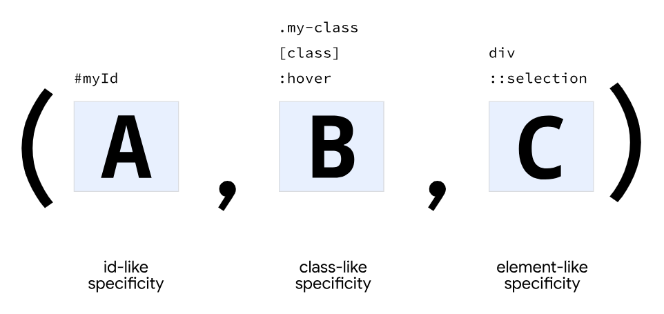
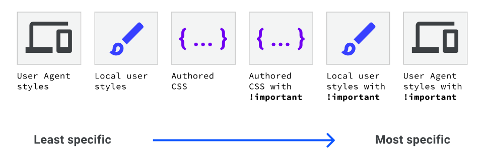

CSS Reference

# Box Model

# Selectors

It is only possible to select downwards.

## Simple selectors

- universal: `*` {}
- type: `section` {}
- class: `.my-class` {}
- id: `#myId` {}
- attribute: `[data-type='primary']` {}

Group multiple seperators by seperating them with commas.

## Pseudo-classes

For specific platform state (=> HTML element is in specified state)
- syntax : `:`

List:

- `a:hover`
- `p:nth-child(even)`

## Pseudo-elements

Act as if they are inserting new elements.
- syntax: `::`

## Complex selectors

### Selector Combinators:
- descendant combinator: ` ` (whitespace)
    - children
- Child combinator: `>`
    - direct children
- next sibling combinator: `+`
    - element that immediately follows another element (with the same parent)
    - A+B would work for `<parent>A, B, C</parent>`
    - typical use: `.my-class * + *` 
        => select every child with my-class as parent, execpt the first child.
- Subsequent- sibling combinator: `~`
    - element has to follow another element with the same parent
    => elements just have to share the same parent (no matter if elements are in between)
    - A~C would work for `<parent>A, B, C</parent>`, while A+B would not

### Compound selectors

When combining multiple selectors.

# Specificity

# Cascade

The cascade is the algorithm for solving conflicts where multiple CSS rules apply to an HTML element:

1. Position
    - latest (bottom) wins
2. Specificity
    - higher specificy wins
3. Origin
    - User agent base styles: browser applied defaults
    - Local user styles: from the operating system (e.g. base font size)
    - authored css: css you write yourself

4. Importance

# Inheritence

## How it works

An element get a **computed** value for inheritable properties that represent its parents's value:

1. cascade looks for a value for the element
2. if not found AND inheritable => inherit **computed** from parent
3. if not found AND not inheritable => use initial value (from CSS spec)

**Important facet:**  
the initial value != the computed value 

=> the initial value is never directly inherited

## Initial value
- every HTML element has **every** CSS property defined by default with an initial value (from the CSS spec).
- initial value is a property that is not inherited, but is used as default value if the cascade fails to calculate a value

## Inherited properties (examples): 
  - font properties (line-height, font-size, font-family, color etc.)
  - text-align
  - visibility

## Explicit control

Explicitly control via keywords:
- inherit: inherit from parent (use-case: to create exceptions)
- initial: use the default value from CSS spec
- unset: either equal to inherit or initial, depending on if the property is inheritable
    - special use-case: `p { all: unset }`
- revert: other styles you wrote (= author layer) don't apply. 

# Sources
Sources for this document: [https://web.dev/learn/css](https://web.dev/learn/css)